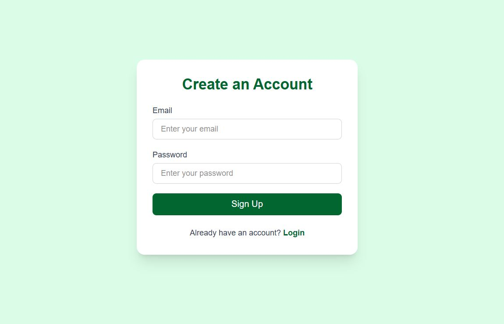
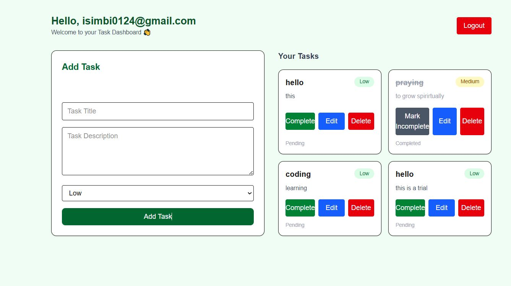

# Firebase crud task App (Next.js + Firebase)

A fully authenticated task management application built with **Next.js (App Router)**, **TypeScript**, **Firebase Authentication**, and **Cloud Firestore**.  
Users can **register, login, create tasks, edit tasks, mark tasks as completed, and delete tasks** — all in a personalized dashboard.

---

## 🚀 Tech Stack
- **Next.js 14** (App Router) + **TypeScript**
- **React 19**
- **Firebase Authentication** (Email & Password)
- **Cloud Firestore** (Real-time database)
- **Tailwind CSS** for UI

---

## 🎯 Features
| Feature | Description |
|--------|-------------|
| User Authentication | Secure login & registration using Firebase Auth |
| Protected Dashboard | Only logged-in users can access tasks |
| Add Tasks | Title, description, and priority level |
| Edit Tasks | Update any task fields |
| Mark Completed | Track task completion ✅ |
| Delete Tasks | Remove tasks instantly |
| Real-Time Sync | Changes appear instantly using `onSnapshot` |
| User-Specific Data | Each user only sees their own tasks |

---

## 📁 Project Structure (Important Files)

├ app/
  (auth)
   │ ├ login/page.tsx → Login page
   │ ├ register/page.tsx → Register page
│ └ dashboard/page.tsx → Main Task Dashboard
├ lib/
│ └ firebase.ts → Firebase config (auth + firestore)
├ page.tsx
## 🔧 Setup Guide

### 1 Clone the project
bash
git clone <your-repo-url>
cd <project-folder>
npm install

### 2 Setup Firebase
 

Go to: https://console.firebase.google.com

Create a project → Enable:

Authentication → Email/Password

Firestore Database

Then create a Web App and copy your Firebase config.

Create .env.local in project root:

NEXT_PUBLIC_FIREBASE_API_KEY=your_key
NEXT_PUBLIC_FIREBASE_AUTH_DOMAIN=your_domain
NEXT_PUBLIC_FIREBASE_PROJECT_ID=your_project_id
NEXT_PUBLIC_FIREBASE_STORAGE_BUCKET=your_bucket
NEXT_PUBLIC_FIREBASE_MESSAGING_SENDER_ID=your_sender_id
NEXT_PUBLIC_FIREBASE_APP_ID=your_app_id

### 3 Start the development server
npm run dev

Visit → http://localhost:3000

### Security Rule Example
// Only allow a user to manage tasks where userEmail matches auth email
rules_version = '2';
service cloud.firestore {
  match /databases/{database}/documents {
    match /tasks/{task} {
      allow read, write: if request.auth != null &&
        request.auth.token.email == resource.data.userEmail;
    }
  }
}
### Test Login
Email: isimbi0124@gmail.com
Password: 1234567890

### Screenshots

